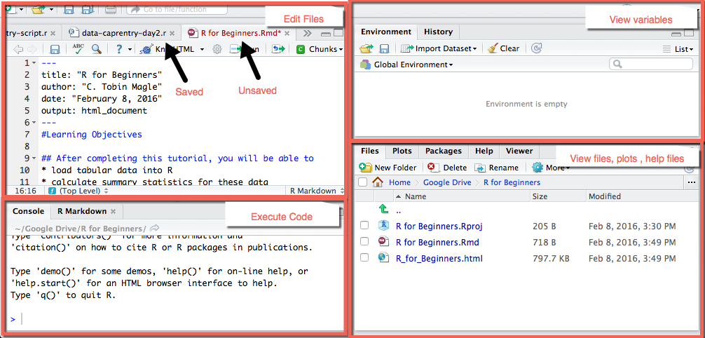
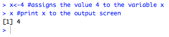
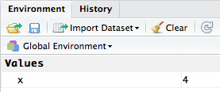
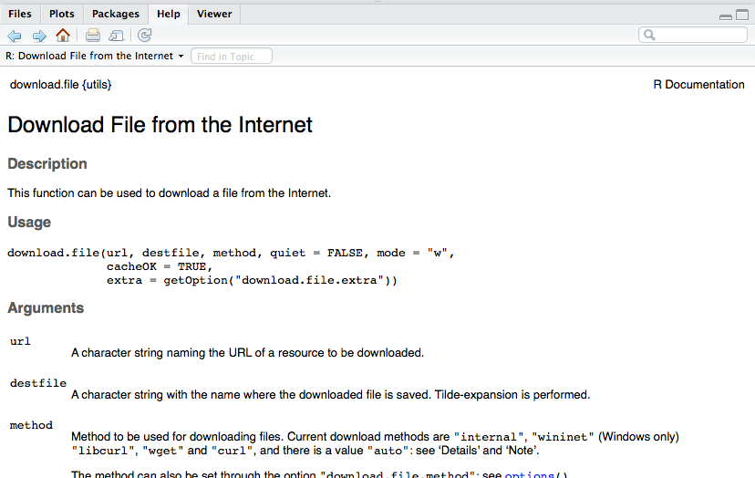

This material was adapted from the following Data Carpentry lesson
http://www.datacarpentry.org/R-ecology/

#Learning Objectives

### After completing this tutorial, you will be able to 
* load tabular data into R
* calculate summary statistics for these data
* create a publication-quality graph

#Introducing R Studio
R studio makes programming in R easier. See what the different windows
represent below

**Layout Overview:** 
**Upper left**: where you write your scripts  
**Upper right**: view the variables  
**Lower left**: where the code is executed  
**Lower Right**: where to view help files, plots, and loaded files  

#Getting ready to code
One of the hardest things about any programming language is remembering the syntax. 
Missing one semicolon or mispelling a variable or function name cause your code 
to fail. Luckily, you can use scripts to save code that you have written, with 
notes to indicate what the code does.

###Open a script file
Scripts let you save your code to run whenever you want. To open a new script:   

* Go to the __File__ menu  
* Select __NewFile__  
* Select __R Script__  

Now save the script to where you want to work. Every time you make changes to the script, the name of the script turns red, and a star appears after the name. Go to __File>Save__ to save the file. You can also use the appropriate short key (__ctrl-s__ for PC, __command-s__ for MacOS).  

**Remember: Save early, save often!**

###Set your working directory
Since we're going to be downloading and importing files, it's important to set 
your working directory so R knows where to look for the files. To set your 
working directory:

* Go to the __Session__ menu
* Select __Set Working Directory__
* Select __Source File Location__

Now R will look where the script is located for your data files. If your script
and your files are in a different location for some reason, you can choose a 
different working directory by selecting __Choose Directory__, but for the 
purposes of this tutorial, let's just keep it in the script location. 

#Operators
Operaters are used to perform mathematical and logical operations. But more simply, they allow you to assign values to variables and combind/compare their values. 

Operators can be broken into 4 catergories: __assignment__, __logical__, __arithmetic__, __relational__

You can find a more thorough discussion of these operators [here](http://www.programiz.com/r-programming/operator), but for now we'll focus on assignment operators.

###Assignment operator
One of the most basic things to do in programming is to assign a value to a 
variable. Let's say you want to assign the value 4 to the variable x. 
To do this in R, use the following syntax: 

```{r}
x<-4 #assigns the value 4 to the variable x
```

Now, check your work. When you type in 'x'

```{r}
x #print x to the output screen
```

R outputs the number 4. 

How do we send this code to the **Console** (lower left window) to actually run the code? There's a short key for that! 
* Put your cursor on the line of code you'd like to run
* Use ctrl-Enter to send that line of code to the console
* The cursor then jumps to the next line of code
* Repeat as necessary
* you can also highlight a block of code

Your __Console__ should look like this now (lower left window)  



Also, you should see the variable x in your __Global Environment__ (upper right window)  



###Why not use =?
The equal sign (=) works the same as the assignment operator [in most cases](http://blog.revolutionanalytics.com/2008/12/use-equals-or-arrow-for-assignment.html).

It also serves a separate purpose in R. Instead of assigning values 
to variables, it's used to define arguments to functions. We'll show you what
this means as we start to use functions later in this tutorial.

So, it's a matter of preference. This tutorial will use <- for clarity.

#Functions
Functions are discete units of R code that allow you to perform specific tasks. 
You can find functions:

* __In the R base package__: no extra installation required. 
* __In external packages__: because R is open source, many people create their 
own functions for specific purposes and make them available in the CRAN repository. 
* __Make your own!__: you can write your own functions. 

We'll be using functions from the base package in this tutorial.

Now we'll go over some really useful functions to use in R.

###Loading files
You can also use the assignment operator to load tabular data into R. 

Let's use a data table called **inflammation.csv** that contains daily 
antibody levels for 30 days after the administration of a vaccine. The table 
also contains data about the gender of the subjects.

####Downloading files
You can download the file at this address: 
[here](https://raw.githubusercontent.com/maglet/r-for-beginners/362063af5e1ad3ba2d3de36110fde9889057a301/inflammation.csv)

But why not use R to do the downloading for you? That's what the **download.file**
function is for. 

Here's the code to download a file in R.
```{r}
download.file(url="https://raw.githubusercontent.com/maglet/r-for-beginners/362063af5e1ad3ba2d3de36110fde9889057a301/inflammation.csv",
              destfile = "inflammation.csv")
```

See what I mean about '=' being used for something different in R? It's used to 
give the function's __arguments__ values. Arguments are information that is 
necessary to run the function. In this case, we need to know where the file is online and where you want to store it locally.

* The __url__ argument specifies where the file is on the web
* The __destfile__ argument specifies where you want the downloaded data to be stored. We're not including a file path, so it defaults to the working directory. You can name the fil whatever you want.
* Make sure both the url and the destination file are in quotes. 

If you're not sure what arguments a function can take, type ?<name of function>.
This command will open the help file for the function in the lower right of the 
R Studio console. 

For example, this is how you'd pull up the help file for __download.file__
```{r}
?download.file # get R documantation for download.file function
```


It takes a while to learn how to effectively read the R help files, but don't worry. We will explain all of the functions and arguments you need in this tutorial. You shouldn't have to rely much on the help files. 

####Loading the data into R
Now that you've downloaded the data you want to work with, it's time to load it 
into R. We're going to use the assignment operator in conjuntiocn with a 
function called **read.csv**.

Below is the syntax to read the inflammation.csv file into R.

```{r}
inflammation<-read.csv("inflammation.csv") #reads data from the csv file
```

Now your global environment looks something like this: 

~[](globalenv2.png)

There's a new dataset called __inflammation__. You can call it (mostly) whatever you 
want, but descriptive names are better. What's a better name for this dataset?

###Inspecting your data
Now, what you can do with the data set in r depends on the content and type of 
data in __inflammation__. 

To find out the format that R is storing the data in, you can use the function
__class__. Every variable in R has a class, including the variable __x__ from 
earlier. Let's see what class these two items are. 

```{r}
class(x)
class(inflammation)
```

So, x is numeric, which makes sense because it's a number. 
Inflammation is a data frame. This is a special R format that makes dealing with 
tabular data easier.  

* Each column represents a variable that is being measured in the experiment. In 
this case, it's patient number, gender, and 30 day readings for antibody levels.
* Each row is a separate observation. In this case, it's all of the patients in 
the study. 
* Each column must have data all of the same type (for example, all numeric)
* The data set must be "rectangular", which means all variables (columns) must 
have the same number of observations (elements).

To see how the data are formatted in a data frame, you can use the 
__head__ command. It takes one argument (the data frame).

```{r}
head(inflammation) #displays the first 6 elements of all columns
```

By default, __head__ will display the first 6 values of each column in the data frame. 

If you want to see the entire data frame in a new tab, use the __View__ command. 

```{r}
View(inflammation) #opens the data frame in a new tab
```

To find out what data type is contained in each column, use the __str__ command 
(which stands for structure) to get more information.

```{r}
str(inflammation)
```

By default, __str__ displays the dimensions of the data frame (720 observations 
x 32 variables) and the name of each variable (ID, Gender, day1...) followed by 
the type of data (__Factor__ or __integer__) and the first 10 elements in the 
column. 

In this dataset, each day column hold a list of integers that represent 
antibody levels. 

But what does it mean to say that X and Gender are factors? Factors are 
categorical data that describe the observation.

* _ID_ is a factor with 720 levels, the same as the number of observations. This is 
good because X is meant to be a unique identifier for each patient. This is not 
a very useful factor. 
* __Gender__ is a factor with 2 levels: "M" or "F". You can use this factor to split 
the data into male and female subgroups. We'll come back to this point later. 

####Subsetting
Especially with large data sets, 
$ operator


Tables?

summary

####Subsetting


####Plotting data

#Resources
Congrats! Now you know enough R programming to be dangerous! If want to learn more, see these resources:
* Loading packages
* 