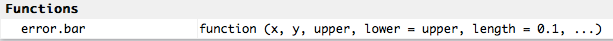

This material was adapted from the [Software Carpentry] [Inflammation](http://swcarpentry.github.io/r-novice-inflammation/01-starting-with-data.html) and [Gapminder]("https://raw.githubusercontent.com/swcarpentry/r-novice-gapminder/gh-pages/_episodes_rmd/data/gapminder-FiveYearData.csv")lessons. This document and associated script can be found at
[https://github.com/maglet/r-for-beginners](https://github.com/maglet/r-for-beginners)

#Learning Objectives

### After completing this tutorial, you will be able to 
* load tabular data into R
* calculate summary statistics for these data
* create a publication-quality graph

#Software
This tutorial requires R and R studio to be installed. If you don't have these 
installed, please use [this tutorial](http://web.cs.ucla.edu/~gulzar/rstudio/).

#Introducing R Studio
R studio makes programming in R easier. One of the hardest things about any 
programming language is remembering the syntax. Missing one semicolon or 
mispelling a variable or function name can cause your code to fail. Luckily, you
can use scripts to save code that you have written, with notes to indicate what 
the code does.

###Set up your workspace
R studio has a "project" functionality that allows users to save settings and organize their work. To create an R project:
* Go to the __File__ menu  
* Select __New Project__ 

<<<<<<< HEAD
This action creates a popup window where you have to make some choices. Since we're starting from scratch, select __New Directory__


Then since we're writing scripts for personal use, select empty project.


Finally, we have to decide where to put our project and what to call it
* Call it __r-for-beginners_
* Select __Desktop__ as the location
* Check the box for Create a git repository. Git is a version control system, which allows you to keep track of all your changes and back your work up to the cloud if you wish. 


=======
>>>>>>> 793deb89a8debd2c0c653f0acd08b3651be0e659
###Open a script file
Scripts let you save your code to run whenever you want. To open a new script:   

* Go to the __File__ menu  
* Select __New File__  
* Select __R Script__  

Now save the script to in the project directory. Every time you make changes to 
the script, the name of the script turns red, and a star appears after the name. 
Go to __File>Save__ to save the file. You can also use the appropriate short key 
(__ctrl-s__ for PC, __command-s__ for MacOS).  

**Remember: Save early, save often!**

See what the different windows represent below.


**Upper left**: Editer- where you write your scripts  
**Upper right**: Environment- view the variables defined in your environment  
**Lower left**: Console- where the code is executed  
**Lower Right**: Help: where to view help files, plots, and loaded files  

#Operators
Operaters are used to perform mathematical and logical operations. But more 
simply, they allow you to assign values to variables and combine/compare their 
values. 

Operators can be broken into 4 categories: __assignment__, __logical__, 
__arithmetic__, __relational__.

You can find a more thorough discussion of these operators [here](http://www.programiz.com/r-programming/operator). Here are some examples of each operator.

###Assignment operators
One of the most basic things to do in programming is to assign a __value__ to a 
__variable__. Let's say you want to assign the value 4 to the variable x. 
To do this in R, type the following into your script file: 

```{r}
x<-4 #assigns the value 4 to the variable x
y<-8 #assigns the value 8 to the variable y
```

So now, when you type in 'x' R outputs the number 4 and 8 for y. 

How do we send this code to the **Console** (lower left window) to actually run the code? There's a short key for that! 

* Put your cursor on the line of code you'd like to run
* Use ctrl-Enter to send that line of code to the console
* The cursor then jumps to the next line of code
* Repeat as necessary
* you can also highlight a block of code, and use ctrl-Enter to send it to the 
console at once.

Your __Console__ should look like this now (lower left window)  


Also, you should see the variables x and y in your __Global Environment__ (upper right window)  


###Why not use =?
The equal sign (=) works the same as the assignment operator [in most cases](http://blog.revolutionanalytics.com/2008/12/use-equals-or-arrow-for-assignment.html).

It also serves a separate purpose in R. Instead of assigning values 
to variables, it's used to define arguments to functions. We'll show you what
this means as we start to use functions later in this tutorial.

So, it's a matter of preference. This tutorial will use <- for clarity.

###Using comments. 

As you write your code, it's a great idea to document it in human-readable 
language. Any text after the '#' symbol will not be executed. Let's 
try it.

```{r}
y<-"This is not in a comment" #This text will be assigned to the variable y
#y<-"This is in a comment"    #This text will not
y                             #prints y to the console
```

The system only prints out the value that was assigned in the un commented code. 
Use comments to take notes about what the code does. 

###Arithmetic Operators
These operators let you do math in r. They are fairly intuitive. For example, if you want to add x and y:

```r{}
x + y
```

And you get the answer 12. Similarly, you can subtract, multiply, divide, use exponents, do integer division, or get the remainder of division.

```r{}
x-y
x*y
x/y
x^2
y%/%x
y%%x
```

###Relational Operators
R can also compare values using relational operators. Say you want to know whether one value is bigger than another:

```r{}
x>y
(x+y/x) > (x+y/y)
```

And R tells you whether that's true or false. You can also evaluate less than, less than or equal to, greater than or equal to, equal to or not equal to

```r{}
x < y
x <= y
x >= y
x == y
x != y
```

###Logical Operators
You can also use logical operators to string relational operators together. For example, let's say you want to evaluate whether more than one thing is true at a time. like whether x is greater than y and less than z.

```r{}
z<-45 #creating a Z
(x>y) & (x<z) #AND operator: Both must be true to get a true result
```

Other logical operators inclue
```r{}
(x>y) | (x<z) #OR operator: one must be true
!(x>y) | (x<z) #NOT operator: returns the opposite of above
```

#Functions
Functions are discete units of R code that allow you to perform specific tasks. 
You can find functions:

* __In the R base package__: no extra installation required. 
* __In external packages__: because R is open source, many people create their 
own functions for specific purposes and make them available in the CRAN repository. 
* __Make your own!__: you can write your own functions. 

We'll be using functions from the base package in this tutorial.

Now we'll go over some really useful functions to use in R.

###Loading files
You can use the assignment operator to load tabular data into R. 

Let's use a data table called **gapminder.csv** that contains daily 
antibody levels for 30 days after the administration of a vaccine. The table 
also contains data about the gender of the subjects.

####Downloading files
You can download the file at this address: 
[here]("https://raw.githubusercontent.com/swcarpentry/r-novice-gapminder/gh-pages/_episodes_rmd/data/gapminder-FiveYearData.csv")

But why not use R to do the downloading for you? That's what the **download.file**
function is for. 

Here's the code to download a file in R.
```{r}
download.file("https://raw.githubusercontent.com/swcarpentry/r-novice-gapminder/gh-pages/_episodes_rmd/data/gapminder-FiveYearData.csv", destfile = "gapminder.csv", method="auto")
```

See what I mean about '=' being used for something different in R? It's used to 
give the function's __arguments__ values. Arguments are information that the 
function needs to run. In this case, we need to know where the file is online 
and where you want to store it locally.

* The __url__ argument specifies where the file is on the web
* The __destfile__ argument specifies where you want the downloaded data to be 
stored. If you don't include a file path, the function saves the file in the 
working directory.
* Make sure both the url and the destination file are in quotes. 

If you're not sure what arguments a function can take, type "help(FunctionName)".
This command will open the help file for the function in the lower right of the 
R Studio console. 

For example, this is how you'd pull up the help file for __download.file__
```{r}
help(download.file) # get R documentation for download.file function
```


It takes a while to learn how to effectively read the R help files, but don't worry. We will explain all of the functions and arguments you need in this tutorial. You shouldn't have to rely much on the help files. 

####Loading data into R
Now that you've downloaded the data you, you can load it into R. We're going to 
use the assignment operator and the **read.csv** function.

Below is the syntax to read the __gapminder.csv__ file into R.

```{r}
gapminder <- read.csv("gapminder.csv") #reads data from the csv file
```

Now your global environment looks something like this: 


There's a new dataset called __gapminder__. Descriptive variable names are 
good.

###Inspecting your data
What you can do with the data set in r depends on the content and type of 
data in __gapminder__. 

To find out the format that R is storing the data in, you can use the function
__class__. Every variable in R has a class, including the variables __x__ and 
__y__ from earlier. Let's see what class these two items are. 

```{r}
class(x)
class(y)
class(gapminder)
```

__x__ is numeric; __y__ is character, as expected. 

gapminder is a __data frame__. This is a special R format that makes dealing 
with tabular data easier.  

* __Each column is a variable__. In this case, it's patient id, gender, and 30 
days of antibody levels.
* __Each row is an observation__. In this case, it's all of the patients in 
the study. 
* __Each column must contain the same data type__ (for example, all numeric)
* __The data set must be "rectangular"__, which means all variables (columns) must 
have the same number of observations (elements).

To see how the data are formatted in a data frame, you can use the 
__head__ command. It takes one argument (the data frame).

```{r}
head(gapminder) #displays the first 6 elements of all columns
```

By default, __head__ will display the first 6 values of each column in the data frame. 

If you want to see the entire data frame in a new tab, click on the name of the
variable in the __Environment__ window. A spreadsheet will open as a new tab in 
the editor (upper left). 

  


To find out what data type is contained in each column, use the __str__ command 
(which stands for structure) to get more information.

```{r}
str(gapminder)
```

By default, __str__ displays the dimensions of the data frame (720 observations 
x 32 variables) and the name of each variable (ID, Gender, day1...) followed by 
the type of data (__Factor__ or __integer__) and the first 10 elements in the 
column. 

In this dataset, each day column hold a list of integers that represent 
antibody levels. 

But what does it mean to say that __id__ and __Gender__ are factors? __Factors__ 
are categorical data that describe the observation.

* __id__ is a factor with 720 levels, the same as the number of observations. This 
is good because __id__ is meant to be a unique identifier for each patient. This 
is not a very useful factor though, because you can't group the data by this 
variable. 
* __Gender__ is a factor with 2 levels: "M" or "F". You can use this factor to 
split the data into male and female subgroups. We'll come back to this point 
later. 

Finally, to get the min, max, median, mean, and quartiles for the numerica data,
and the counts for the factor variables, you can use the __summary__ command. 
```{r}
summary(gapminder)
```

####Subsetting
Especially with large data sets, sometimes you need to assess a particular part 
of the data. Depending on what you want to do, you'll either want to work with 
a subset of rows or columns. We'll look at how to subset by both. 

#####Subsetting Columns
Let's say that you're only interested in the population data. Use the 
following code to extract only the population data and store it in a variable called
__pop__

```{r}
pop<-gapminder$pop
```

* You already know about the assignment operator (<-)
* The __$__ operator lets you subset the data fram based on column name
* __Syntax__: (variable name)__$__(column name)

Now you should see a new variable called __pop__  with 720 
elements in your global environment. 

You can get the same subset using the "[row,column]" format:
```{r}
pop2<-gapminder[,3]
```

* __Syntax__: the row you want and the column you want, in brackets, separated 
by a comma
* Leaving either field blank, will select ALL elements, in this case all rows
* the population data are stored in column 32 of the data frame.

Prove to yourself that these data sets are equal using a __Boolean operator__ 
"==". Make sure to use the double equal sign when you're evaluating whether 
2 values are equivalent. A single "=" will try to perform an assignment operation.

Running __pop == pop2__ would give you  so we'll 

```{r}
pop == pop2
```

The above code returns a list of TRUE/FALSE values that indicate whether the values in each postition of the list match. Scanning through that list could get tedious,
so instead we can use the fact that __TRUE__ in R is equivalent to __1__, and 
__FALSE__ is the equivalent of __0__. Thus, if all elements are equal to each other,
the sum of that list of __TRUE__ s and __FALSE__ s would be equal to the number of 
rows.

```{r}
nrow(gapminder)==sum(pop == pop2)
```

It checks out! And now you only have to look at one result.

Now let's calculate the mean of this column:

```{r}
mean(pop)
```

But what if you want to find the mean for all of the numeric columns? That's where the 
__apply__ function comes in. This function applies a function (__FUN__) to a 
chunk of data (__X__) on either the rows or columns (__MARGIN__).

Here's how you get the mean and standard deviation for all of the day columns:
```{r}
colmeans<-apply(X=gapminder[,c(3,5,6)],  #the data you want to use
                MARGIN=2,               #apply the function to the columns
                FUN=mean)               #take the mean of the values

colsds<-apply(X=gapminder[,c(3,5,6)],     #the data you want to use
             MARGIN=2,                  #apply the function to the colummns
             FUN=sd)                    #take the standard deviation of the columns
```

* __X=gapminder[,c(3,5,6)]__: grabs the 3rd to 32nd columns of the data frame
* __MARGIN = 2__: tells apply to run the function on each column (MARGIN=1 would
indicate rows)
* __FUN= mean__: tells apply to run the mean function 

You can get the mean for each patient as well by changing the __margin__.

```{r}
rowmeans<-apply(X=gapminder[,c(3,5,6)],    #the data you want to use
               MARGIN=1,                 #apply the function to rows
               FUN=mean)                 #take the mean of the rows
```

#####Subsetting Rows. 

But what if you only want to see values for a certain subset countries? That's
where the __subset__ function comes in. Suppose you want to get population 
values only for African countries and store that subset in a variable called 
__AfricaPop__.

```{r}
AfricaPop <- subset(x= gapminder,            #the data frame to subset
                        subset = (continent == "Africa"))   #the factor to subset on
```

* __x = gapminder__: tells subset the data set we want to use
* __subset = (continent == "Africa")__: a boolean expression that tells subset to only 
select observations (rows) with the value "Africa" in the continent variable (column).

Let's do the same thing for Asian countries
```{r}
AsiaPop <- subset(x= gapminder,            #the data frame to subset
                        subset = (continent == "Asia"))   #the factor to subset on
```

Now we can compare the data for the two groups using a t-test:

```{r}
t.test(AfricaPop$pop, AsiaPop$pop)
```

That's a pretty low p value. 

####Plotting data
Lastly, we're going to look at how to plot these data. The R base graphics 
package has many options for plotting your data. Many people prefer more 
advanced packages, such as [ggplot2](http://zevross.com/blog/2014/08/04/beautiful-plotting-in-r-a-ggplot2-cheatsheet-3/), but we will stick to the base package here for 
simplicity's sake.

We'll be working with __histograms__, __bar  plots__, __box plots__, 
__scatter plots__, and __a basic plot with colorization by factors__. 

First, let's look at the distribution of values of day 30 inflammation, and 
just for kicks, we'll make the bars blue. Make sure to label the axes!

```{r}
hist(x=gapminder$pop,    #plots inflammation at day 30 for all patients
     main="Histogram of Population", #main title
     xlab="population",                        #x axis label
     ylab="Frequency",                                 #y axis label
     col="blue")                                       #color
```

This allows you to see how your data are distributed. Remember how hard it is to [make a histogram in Excel](https://support.microsoft.com/en-us/kb/214269)? That's a thing of the past for you now.

Now let's look at making a bar chart of the averages for each day using our 
variable daymeans.

```{r}
barplot(height=colmeans,                     #height of the bars 
        main="Mean inflammation over time",  #main graph title
        xlab="Days post vaccine",            #x axis label
        ylab="Mean Inflammation")            #y axis label
```

But wait, where are the error bars? This requires some extra code.

A great way to find code is to look at R blogs. I found some code to make box 
plots [here](http://monkeysuncle.stanford.edu/?p=485) and adapted it to our 
purposes.

Here's a function to plot the error bars. I didn't need to change anything here, 
because we'll provide our arguments during the function call. 
```{r}
error.bar <- function(x, # the bar plot
                      y, #daily means
                      upper, #standard deviation
                      lower=upper, #error bars in both directions
                      length=0.1,...) #length of the arrow head (in inches)
{
     if(length(x) != length(y) | length(y) !=length(lower) | length(lower) != length(upper))
          stop("vectors must be same length")
     arrows(x0=x,            #point to draw the arrow from (x)
            y0=y+upper,      #                             (y)
            x1=x,            #                        to (x) 
            y1=y-lower,      #                        to (y)
            angle=90,        #draw it at a 90 degree angle
            code=3,          #choose type of arrow
            length=length,   #length of the arrow head (inches)
            ...)             #sends graphics paramenters from the function call 
}
```

Now there is a function called __error.bar__ in your environment. 



Now I replaced their randomly generated variables with the ones that we want to 
plot in the function call. 

```{r}
#This command draws the plot w/o error bars
barx <- barplot(height=colmeans,     #height of the bars 
                ylim=c(0,16),        #y axis range, determined by tweaking
                col="blue",          #blue bars
                axis.lty=1,          #choose line type (opaque) for y axis
                xlab="Day post vaccination",                #x axis label
                ylab="Mean inflammation (arbitrary units)") #y axis label

#this function draws the error bars
error.bar(barx, colmeans, colsds)
```

(The error is appearing because the error bar for day 1 is length zero, because
all values on day 1 are 0.)

Now let's draw a box plot, separating the data based on gender.
```{r}
          #Data to plot      #factor to separate on
boxplot(gapminder$pop ~ gapminder$continent,
        main="Day 30 inflammation by gender",
        ylab="inflammation (day 30)",
        xlab="Gender")
```

Not much of a gender difference, which was expected because of the T-test results.

We can also use colors to differentiate data points based on gender. First, 
print out the inflammation on day 10 for all patients:

```{r}
plot(gapminder$lifeExp)
```

Let's see which of these data points are from females and which are 
from males. I also altered some other useful base graphics packages to get the
image ready for publication:

```{r}
plot(gapminder$lifeExp, 
     xlab="Patient #",        #X axis label
     ylab= "Inflammation",    #Y axis label
     las= 1,                  #Make numbers horizontal on the x axis, 
     cex.lab=1.2,             #Increase axis labels font size
     cex.axis=1.2,            #Increase axis label number size
     lwd=2,                   #Increase line/dot thickness
     bty = "n",               #removes black border around the plot
     pch=16,                  #Specifies symbols to draw
     ylim= c(0,15),            #set y axis limits
     col = gapminder$Continent) #Set Color based on Gender
```

But how do we know which are male and which are female? A figure legend would 
help:

```{r}
plot(gapminder$lifeExp, 
     xlab="Patient #",        #X axis label
     ylab= "Inflammation",    #Y axis label
     las= 1,                  #Make numbers horizontal on the x axis, 
     cex.lab=1.2,             #Increase axis labels font size
     cex.axis=1.2,            #Increase axis label number size
     lwd=2,                   #Increase line/dot thickness
     bty = "n",               #removes black border around the plot
     pch=16,                  #Specifies symbols to draw
     ylim= c(0,15),            #set y axis limits
     col = gapminder$continent) #Set Color based on Gender

legend(x= 0,                                #x position of legend
       y=15,                                #y position of legend
       legend=levels(gapminder$continent),  #Legend text 
       col = c(1:2),                        #colors to use in legend
       pch=16)                              #specifies how to draw symbols
```

#Resources
Congrats! Now you can plot tabular data in R! If you want to learn more, see 
these resources:

* [Installing packages](http://web.cs.ucla.edu/~gulzar/rstudio/)
* [swirl: Learn R in R](http://swirlstats.com)
* [R base grapics: an idiot's guide](http://rstudio-pubs-static.s3.amazonaws.com/7953_4e3efd5b9415444ca065b1167862c349.html)
* [ggplot2](http://zevross.com/blog/2014/08/04/beautiful-plotting-in-r-a-ggplot2-cheatsheet-3/)
* [Elementary statistics with R](http://www.r-tutor.com/elementary-statistics)
* [Software Carpentry](http://software-carpentry.org)
* [Data Carpentry](http://www.datacarpentry.org)