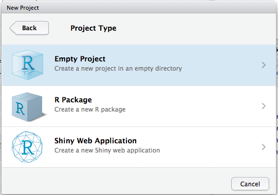

This material was adapted from the Software Carpentry [Inflammation](http://swcarpentry.github.io/r-novice-inflammation/01-starting-with-data.html) and [Gapminder]("https://raw.githubusercontent.com/swcarpentry/r-novice-gapminder/gh-pages/_episodes_rmd/data/gapminder-FiveYearData.csv") lessons. This document and associated script can be found at
[https://github.com/maglet/r-for-beginners](https://github.com/maglet/r-for-beginners)

#Learning Objectives

### After completing this tutorial, you will be able to 
* load tabular data into R
* calculate summary statistics for these data
* create a publication-quality graph

#Software
This tutorial requires R and R studio to be installed. If you don't have these 
installed, please use [this tutorial](http://web.cs.ucla.edu/~gulzar/rstudio/).

#Introducing R Studio
R studio makes programming in R easier. One of the hardest things about any 
programming language is remembering the syntax. Missing one semicolon or 
mispelling a variable or function name can cause your code to fail. Luckily, you
can use scripts to save code that you have written, with notes to indicate what 
the code does.

###Setting up your workspace
R studio has a "project" functionality that allows users to save settings and organize their work. 

####To create an R project  
* go to the __File__ menu  
* select __New Project__ 

####This action creates a popup window where you have to make some choices. Since we're starting from scratch, select __New Directory__

####Then since we're writing scripts for personal use, select empty project.

####Finally, we have to decide where to put our project and what to call it 
* Call it __r-for-beginners__
* Select __Desktop__ as the location
* Check the box for Create a git repository. Git is a version control system, which allows you to keep track of all your changes and back your work up to the cloud if you wish. 

###Open a script file
Scripts let you save your code to run whenever you want. To open a new script:   

* Go to the __File__ menu  
* Select __New File__  
* Select __R Script__  

Now save the script to in the project directory. Every time you make changes to 
the script, the name of the script turns red, and a star appears after the name. 
Go to __File>Save__ to save the file. You can also use the appropriate short key 
(__ctrl-s__ for PC, __command-s__ for MacOS).  

**Remember: Save early, save often!**

See what the different windows represent below.

**Upper left**: Editer- where you write your scripts  
**Upper right**: Environment- view the variables defined in your environment  
**Lower left**: Console- where the code is executed  
**Lower Right**: Help: where to view help files, plots, and loaded files  

### Take home points:
* R studio is a development environment for the R language
* R studio project allow you to organize your work in 1 place
* R scripts allow you to save your code to re-run or edit
* R studio can integrate git, a version control system

### Challenge Questions: 
1. What does the bottom right window (console) of the R studio interface do?

2. Why should you set up a .git repository in your project directory?
keep track of changes, backup online

3. If you don't specify otherwise, which directory is R studio workingin by default when you open a project