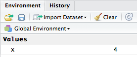

This material was adapted from the Software Carpentry [Inflammation](http://swcarpentry.github.io/r-novice-inflammation/01-starting-with-data.html) and [Gapminder]("https://raw.githubusercontent.com/swcarpentry/r-novice-gapminder/gh-pages/_episodes_rmd/data/gapminder-FiveYearData.csv") lessons. This document and associated script can be found at
[https://github.com/maglet/r-for-beginners](https://github.com/maglet/r-for-beginners)

#Operators
Operaters are used to perform mathematical and logical operations. But more 
simply, they allow you to assign values to variables and combine/compare their 
values. 

Operators can be broken into 4 categories: __assignment__, __logical__, 
__arithmetic__, __relational__.

You can find a more thorough discussion of these operators [here](http://www.programiz.com/r-programming/operator). Here are some examples of each operator.

###Assignment operators
One of the most basic things to do in programming is to assign a __value__ to a 
__variable__. Let's say you want to assign the value 4 to the variable x. 
To do this in R, type the following into your script file: 

```{r}
x<-4 #assigns the value 4 to the variable x
y<-8 #assigns the value 8 to the variable y
```

So now, when you type the variable name in the console, R outputs the number 4 and 8 for y. 

How do we send this code to the **Console** (lower left window) to actually run the code? There's a short key for that! 

* Put your cursor on the line of code you'd like to run
* Use ctrl-Enter to send that line of code to the console
* The cursor then jumps to the next line of code
* Repeat as necessary
* you can also highlight a block of code, and use ctrl-Enter to send it to the 
console at once.

Your __Console__ should look like this now (lower left window)  


Also, you should see the variables x and y in your __Global Environment__ (upper right window)  



###Why not use =?
The equal sign (=) works the same as the assignment operator [in most cases](http://blog.revolutionanalytics.com/2008/12/use-equals-or-arrow-for-assignment.html).

It also serves a separate purpose in R. Instead of assigning values 
to variables, it's used to define arguments to functions. We'll show you what
this means as we start to use functions later in this tutorial.

So, it's a matter of preference. This tutorial will use <- for clarity.

###Using comments. 

As you write your code, it's a great idea to document it in human-readable 
language. Any text after the '#' symbol will not be executed. Let's 
try it.

```{r}
phrase<-"This is not in a comment" #This text will be assigned to the variable phrase
#phrase<-"This is in a comment"    #This text will not
phrase                             #prints phrase to the console
```

The system only prints out the value that was assigned in the un commented code. 
Use comments to take notes about what the code does. 

###Arithmetic Operators
These operators let you do math in r. They are fairly intuitive. For example, if you want to add x and y:

```{r}
x + y
```

And you get the answer 12. Similarly, you can subtract, multiply, divide, use exponents, do integer division, or get the remainder of division.

```{r}
x-y
x*y
x/y
x^2
y%/%x
y%%x
```

###Relational Operators
R can also compare values using relational operators. Say you want to know whether one value is bigger than another:

```{r}
x>y
```

And R tells you whether that's true or false. You can also evaluate less than, less than or equal to, greater than or equal to, equal to or not equal to

```{r}
x < y
x <= y
x >= y
x == y
x != y
```

###Logical Operators
You can also use logical operators to string relational operators together. For example, let's say you want to evaluate whether more than one thing is true at a time. like whether x is greater than y and less than z.

```{r}
z<-45 #creating the variable z
(x>y) & (x<z) #AND operator: Both must be true to get a true result
```

Other logical operators inclue
```{r}
(x>y) | (x<z) #OR operator: one must be true
!(x>y) | (x<z) #NOT operator: returns the opposite of above
```

### Take home points: 
* There are 4 types of operators: assignment, logical, relational and arithmetic
* assignment operators let you assign values to variables
* relational operators let you compare values
* logical operators let you combine logical values
* arithmetic operators perform arithmetic like addition, subtraction, multiplication and division

### Challenge questions:

1. How would you assign the value 467 to the variable kitten?

2. How woud you determine if the variable cat is greater than the variable dog and that cat is less than pony??

3. Pretend you want to know whether the sum of red and blue is greater than the difference between green and purple. How would you write that out?
