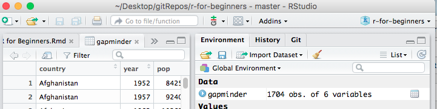

This material was adapted from the Software Carpentry [Inflammation](http://swcarpentry.github.io/r-novice-inflammation/01-starting-with-data.html) and [Gapminder]("https://raw.githubusercontent.com/swcarpentry/r-novice-gapminder/gh-pages/_episodes_rmd/data/gapminder-FiveYearData.csv") lessons. This document and associated script can be found at
[https://github.com/maglet/r-for-beginners](https://github.com/maglet/r-for-beginners)


#Functions
Functions are discete units of R code that allow you to perform specific tasks. 
You can find functions:

* __In the R base package__: no extra installation required. 
* __In external packages__: because R is open source, many people create their 
own functions for specific purposes and make them available in the CRAN repository. 
* __Make your own!__: you can write your own functions. 

We'll be using functions from the base package in this tutorial.

Now we'll go over some really useful functions to use in R.

###Loading files
You can use the assignment operator to load tabular data into R. 

Let's use a data table called **gapminder.csv** that contains population, gross domestic product, and life expectancy information for countries worldwide

####Downloading files
You can download the file at this address: 
[here]("https://raw.githubusercontent.com/swcarpentry/r-novice-gapminder/gh-pages/_episodes_rmd/data/gapminder-FiveYearData.csv")

But why not use R to do the downloading for you? That's what the **download.file**
function is for. 

Here's the code to download a file in R.
```{r}
download.file("https://raw.githubusercontent.com/swcarpentry/r-novice-gapminder/gh-pages/_episodes_rmd/data/gapminder-FiveYearData.csv", #the URL that contains the file 
              destfile = "gapminder.csv")  #What to call the file
```

See what I mean about '=' being used for something different in R? It's used to 
give the function's __arguments__ values. Arguments are information that the 
function needs to run. In this case, we need to know where the file is online 
and where you want to store it locally.

* The __url__ argument specifies where the file is on the web
* The __destfile__ argument specifies where you want the downloaded data to be 
stored. If you don't include a file path, the function saves the file in the 
working directory.
* Make sure both the url and the destination file are in quotes. 

If you're not sure what arguments a function can take, type "help(FunctionName)".
This command will open the help file for the function in the lower right of the 
R Studio console. 

For example, this is how you'd pull up the help file for __download.file__
```{r}
help(download.file) # get R documentation for download.file function
```


It takes a while to learn how to effectively read the R help files, but don't worry. We will explain all of the functions and arguments you need in this tutorial. You shouldn't have to rely much on the help files. 

####Loading data into R
Now that you've downloaded the data you, you can load it into R. We're going to 
use the assignment operator and the **read.csv** function.

Below is the syntax to read the __gapminder.csv__ file into R.

```{r}
gapminder <- read.csv("gapminder.csv") #reads data from the csv file
```

Now your global environment looks something like this: 


There's a new dataset called __gapminder__. Descriptive variable names are 
good.

###Inspecting your data
What you can do with the data set in r depends on the content and type of 
data in __gapminder__. 

To find out the format that R is storing the data in, you can use the function
__class__. Every variable in R has a class, including the variables __x__ and 
__y__ from earlier. Let's see what class these two items are. 

```{r}
class(x)
class(phrase)
class(gapminder)
```

__x__ is numeric; __phrase__ is character, as expected. 

gapminder is a __data frame__. This is a special R format that makes dealing 
with tabular data easier.  

* __Each column is a variable__. In this case, it's patient id, gender, and 30 
days of antibody levels.
* __Each row is an observation__. In this case, it's all of the patients in 
the study. 
* __Each column must contain the same data type__ (for example, all numeric)
* __The data set must be "rectangular"__, which means all variables (columns) must 
have the same number of observations (elements).

To see how the data are formatted in a data frame, you can use the 
__head__ command. It takes one argument (the data frame).

```{r}
head(gapminder) #displays the first 6 elements of all columns
```

By default, __head__ will display the first 6 values of each column in the data frame. 

If you want to see the entire data frame in a new tab, click on the name of the
variable in the __Environment__ window. A spreadsheet will open as a new tab in 
the editor (upper left). 

  


To find out what data type is contained in each column, use the __str__ command 
(which stands for structure) to get more information.

```{r}
str(gapminder)
```

By default, __str__ displays the dimensions of the data frame (720 observations 
x 32 variables) and the name of each variable (ID, Gender, day1...) followed by 
the type of data (__Factor__ or __integer__) and the first 10 elements in the 
column. 

In this dataset, each day column hold a list of integers that represent 
antibody levels. 

But what does it mean to say that __id__ and __Gender__ are factors? __Factors__ 
are categorical data that describe the observation.

* __id__ is a factor with 720 levels, the same as the number of observations. This 
is good because __id__ is meant to be a unique identifier for each patient. This 
is not a very useful factor though, because you can't group the data by this 
variable. 
* __Gender__ is a factor with 2 levels: "M" or "F". You can use this factor to 
split the data into male and female subgroups. We'll come back to this point 
later. 

Finally, to get the min, max, median, mean, and quartiles for the numerica data,
and the counts for the factor variables, you can use the __summary__ command. 
```{r}
summary(gapminder)
```