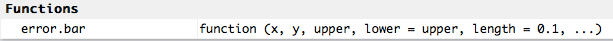

This material was adapted from the Software Carpentry [Inflammation](http://swcarpentry.github.io/r-novice-inflammation/01-starting-with-data.html) and [Gapminder]("https://raw.githubusercontent.com/swcarpentry/r-novice-gapminder/gh-pages/_episodes_rmd/data/gapminder-FiveYearData.csv") lessons. This document and associated script can be found at
[https://github.com/maglet/r-for-beginners](https://github.com/maglet/r-for-beginners)

####Plotting data
Lastly, we're going to look at how to plot these data. The R base graphics 
package has many options for plotting your data. Many people prefer more 
advanced packages, such as [ggplot2](http://zevross.com/blog/2014/08/04/beautiful-plotting-in-r-a-ggplot2-cheatsheet-3/), but we will stick to the base package here for 
simplicity's sake. 

We'll be working with __histograms__, __bar  plots__, __box plots__, 
__scatter plots__, and __a basic plot with colorization by factors__. 

First, let's look at the distribution of values of life expenctancy, and 
just for kicks, we'll make the bars blue. Make sure to label the axes!

```{r}
hist(x=gapminder$lifeExp,    #plots life expectancy for all countries in all years
     main="Histogram of Life Expectancy", #main title
     xlab="Life expectancy",                        #x axis label
     ylab="Frequency",                                 #y axis label
     col="blue")                                       #color
```

This allows you to see how your data are distributed. Remember how hard it is to [make a histogram in Excel](https://support.microsoft.com/en-us/kb/214269)? That's a thing of the past for you now.

Now let's look at making a bar chart of the average life expectancy for each year.

```{r}
barplot(height=gapminder[37:48,5],                    #height of the bars 
        main="Mean life expectancy in Angola 1952-2007",  #main graph title
        xlab="Year",            #x axis label
        ylab="Mean Life expectancy",            #y axis label
        col="green")          #blue bars
```

But wait, where are the error bars? This requires some extra code.

A great way to find code is to look at R blogs. I found some code to make box 
plots [here](http://monkeysuncle.stanford.edu/?p=485) and adapted it to our 
purposes.

Here's a function to plot the error bars. I didn't need to change anything here, 
because we'll provide our arguments during the function call. 
```{r}
error.bar <- function(x, # the bar plot
                      y, #daily means
                      upper, #standard deviation
                      lower=upper, #error bars in both directions
                      length=0.1,...) #length of the arrow head (in inches)
{
     if(length(x) != length(y) | length(y) !=length(lower) | length(lower) != length(upper))
          stop("vectors must be same length")
     arrows(x0=x,            #point to draw the arrow from (x)
            y0=y+upper,      #                             (y)
            x1=x,            #                        to (x) 
            y1=y-lower,      #                        to (y)
            angle=90,        #draw it at a 90 degree angle
            code=3,          #choose type of arrow
            length=length,   #length of the arrow head (inches)
            ...)             #sends graphics paramenters from the function call 
}
```

Now there is a function called __error.bar__ in your environment. 



Now I replaced their randomly generated variables with the ones that we want to 
plot in the function call. 

```{r}
#This command draws the plot w/o error bars
barx <- barplot(height=gapminder[37:48,5],     #height of the bars 
                ylim=c(0,50),        #y axis range, determined by tweaking
                col="green",          #blue bars
                axis.lty=1,          #choose line type (opaque) for y axis
                xlab="Year",                #x axis label
                ylab="Mean life expectancy") #y axis label

#this function draws the error bars
error.bar(barx, gapminder[37:48,5], rep(5, length(gapminder[37:48,5])))
```

(The error is appearing because the error bar for day 1 is length zero, because
all values on day 1 are 0.)

Now let's draw a box plot, separating the data based on continent.

```{r}
          #Data to plot      #factor to separate on
boxplot(gapminder$pop ~ gapminder$continent,
        main="Population by continent",
        ylab="Population",
        xlab="Continent")
```

Wow, Asia and the Americas have outliers. We can zoom on on the box plot ysing the y lim parameter.

```{r}
          #Data to plot      #factor to separate on
boxplot(gapminder$pop ~ gapminder$continent,
        main="Population by continent",
        ylab="Population",
        xlab="Continent",
        ylim=c(0,1.2e+08))
```

We can also use colors to differentiate data points based on continent. First, 
print out the life expectancy data:

```{r}
plot(gapminder$gdpPercap, gapminder$lifeExp)
```

Let's see which of these data points are from which continent. I also altered some other useful base graphics packages to get the image ready for publication:

```{r}
plot(gapminder$gdpPercap, gapminder$lifeExp,
     xlab="GDP per capita",        #X axis label
     ylab= "LifeExpectancy (years)",    #Y axis label (somehow get )
     las= 1,                  #Make numbers horizontal on the x axis, 
     cex.lab=1.2,             #Increase axis labels font size
     cex.axis=1.2,            #Increase axis label number size
     lwd=2,                   #Increase line/dot thickness
     bty = "n",               #removes black border around the plot
     pch=16,                  #Specifies symbols to draw
     ylim= c(0,100),            #set y axis limits
     #xlim=c(200,115000),
     col = gapminder$continent) #Set Color based on Continent
```

But how do we know which go to which continent? A figure legend would 
help:

```{r}
plot(gapminder$gdpPercap, gapminder$lifeExp,
     xlab="GDP per capita",        #X axis label
     ylab= "LifeExpectancy (years)",    #Y axis label (somehow get )
     las= 1,                  #Make numbers horizontal on the x axis, 
     cex.lab=1.2,             #Increase axis labels font size
     cex.axis=1.2,            #Increase axis label number size
     lwd=2,                   #Increase line/dot thickness
     bty = "n",               #removes black border around the plot
     pch=16,                  #Specifies symbols to draw
     ylim= c(0,100),            #set y axis limits
     #xlim=c(200,115000),
     col = gapminder$continent) #Set Color based on Continent

legend(x= 8e+04,                                #x position of legend
       y=50,                                #y position of legend
       legend=levels(gapminder$continent),  #Legend text 
       col = c(1:5),
       pch=16)                              #specifies how to draw symbols
```

#Resources
Congrats! Now you can plot tabular data in R! If you want to learn more, see 
these resources:

* [Installing packages](http://web.cs.ucla.edu/~gulzar/rstudio/)
* [swirl: Learn R in R](http://swirlstats.com)
* [R base grapics: an idiot's guide](http://rstudio-pubs-static.s3.amazonaws.com/7953_4e3efd5b9415444ca065b1167862c349.html)
* [ggplot2](http://zevross.com/blog/2014/08/04/beautiful-plotting-in-r-a-ggplot2-cheatsheet-3/)
* [Elementary statistics with R](http://www.r-tutor.com/elementary-statistics)
* [Software Carpentry](http://software-carpentry.org)
* [Data Carpentry](http://www.datacarpentry.org)